author: Kozzy Hasebe
summary: Anthos Config Management basic level codelab
id: appdev-anthos-config-management-basic-codelab
categories: codelab,markdown
environments: Web
status: Published
feedback link: https://github.com/google-cloud-japan/appdev-anthos-config-management-basic-codelab

# Anthos Config Management Basic Hands-on

## Anthos Config Management

このハンズオンでは Anthos Config Management の導入、設定を通じて基礎的な機能を学習します。

### 1.1 Anthos Config Management (ACM) とは？


ACM を使うことで以下の 2 つのことが実現できます。

- ハイブリッド、マルチクラウド環境に存在する大規模な Kubernetes 環境を一貫性を持った形で、セキュアに管理する
- Google Cloud のリソース (GKE クラスタ、Spanner インスタンス、VM など) を Kubernetes のマニフェストで作成、管理する (IaC の実現)

### 1.2 ACM のコンポーネント

ACM は複数のコンポーネントで構成されています。

- Config Sync
  - GKE クラスタ上で動作し、1 つ以上の Git リポジトリを監視し、自身のクラスタのあるべき状態を継続的に適用します。
- Policy Controller
  - GKE クラスタ上で動作し、クラスタの各種 API 操作に対してポリシーを設定します。
- Config Connector
  - GKE クラスタ上で動作し、Kubernetes のリソースモデルを使い、Google Cloud のリソースを作成します。
- Config Controller
  - Config Sync, Policy Controller, Config Connector が動作するクラスタをホスト型で提供するマネージドサービスです。

## ACM のユースケースとコンポーネント

### 2.1 大規模な Kubernetes 環境を一貫性を持った形でセキュアに管理する

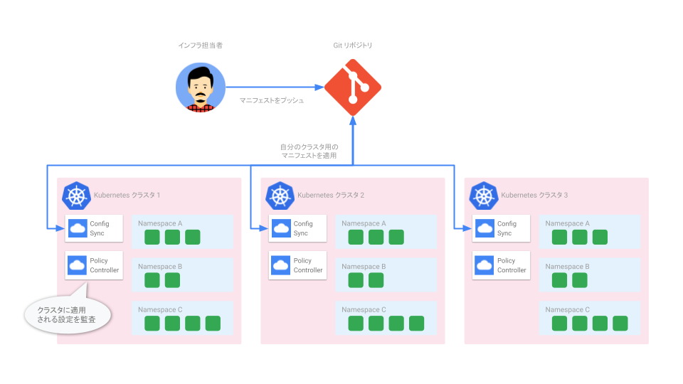

### 2.2 Google Cloud のリソースを KRM で管理する (IaC の実現)

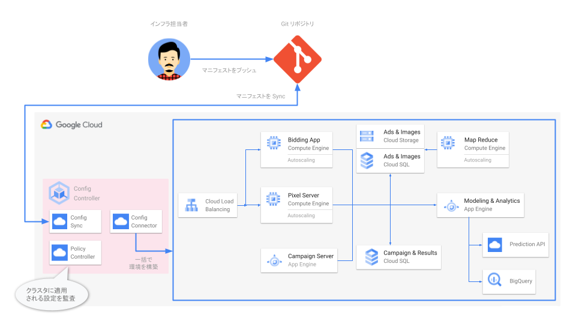

## ハンズオン概要

### 3.1 利用プロダクト

- [Google Kubernetes Engine](https://cloud.google.com/kubernetes-engine/)
- [Anthos Config Management](https://cloud.google.com/anthos/config-management)
- [Cloud Source Repositories](https://cloud.google.com/source-repositories)

### 3.2 前提知識

- Kubernetes の操作、基礎的な Kubernetes リソース (Service, Deployment, Pod) の知識
- Git の基礎的な使い方

### 3.3 前提条件

本ハンズオンは、Billing が有効な Google Cloud プロジェクトで行うこと、また各種コマンドは [Cloud Shell](https://cloud.google.com/shell/) で実行することを前提としています。環境がない場合は、事前に Google Cloud プロジェクトをご用意ください。

## 事前準備

### 4.1 Google Cloud Console へアクセス

[Google Cloud コンソール](https://console.cloud.google.com/) から Google Cloud Console にブラウザでアクセスします。

### 4.2 Cloud Shell の起動

各種コマンドを実行するための CLI 環境である Cloud Shell を開きます。下図の中のリンクをクリックし、Cloud Shell を開きます。

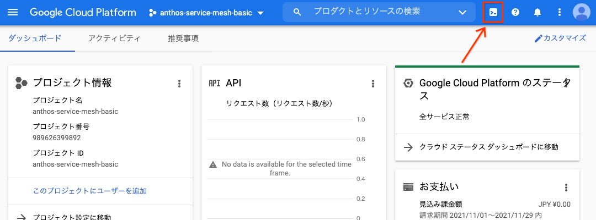

### 4.3 Google Cloud プロジェクトの設定

ハンズオンを実行する対象の Google Cloud プロジェクトを設定します。コマンドの `XXXXXXXX` の部分を実際のプロジェクト ID に置き換えて実行します。プロジェクト ID は[ダッシュボード画面](https://console.cloud.google.com/home/dashboard)のプロジェクト情報カードから確認ができます。

```shell
export PROJECT_ID=XXXXXXXX
gcloud config set project ${PROJECT_ID}
```

実行後、確認メッセージがでてきた場合は承認ボタンをクリックします。

コマンド実行後に以下の様に Cloud Shell のプロンプトに、黄色の文字でプロジェクト ID が表示されていることを確認します。


### 4.4 作業用ディレクトリの作成、移動

ハンズオン用のディレクトリを作成し、そちらに移動します。

```shell
export HANDSON_DIR=${HOME}/acm-handson-${PROJECT_ID}
mkdir -p ${HANDSON_DIR} && cd ${HANDSON_DIR}
```

### 4.5 ハンズオン利用機能 (API) の有効化

Google Cloud では以下のような各種機能を API として提供しており、Google Cloud プロジェクトの作成直後は、ほぼすべての機能が無効化されております。そのため、使いたい機能は事前に有効化する必要があります。ここではアプリケーションをデプロイする対象の GKE、Config Controller に必要な機能群を有効化します。

```shell
gcloud services enable container.googleapis.com \
  monitoring.googleapis.com \
  cloudtrace.googleapis.com \
  clouddebugger.googleapis.com \
  cloudprofiler.googleapis.com \
  sourcerepo.googleapis.com \
  krmapihosting.googleapis.com \
  container.googleapis.com \
  cloudresourcemanager.googleapis.com \
  && gcloud beta container hub config-management enable
```

## 複数クラスタを Anthos Config Management で管理する

以下のような環境を順を追って構築していきます。

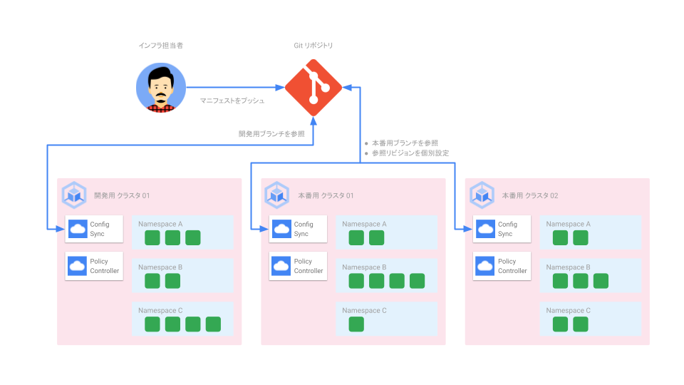

この環境のポイントは以下になります。

- 本番用に 2 つ、開発用に 1 つのクラスタがある
- 本番用、開発用で同じ Git リポジトリを参照する
- 本番用、開発用にブランチを分けて、マニフェストを管理する
- 本番環境では安全性を考慮し Git の更新が即クラスタへの反映にならないようにする

## Google Kubernetes Engine (GKE) クラスタ作成

本手順のゴールイメージ

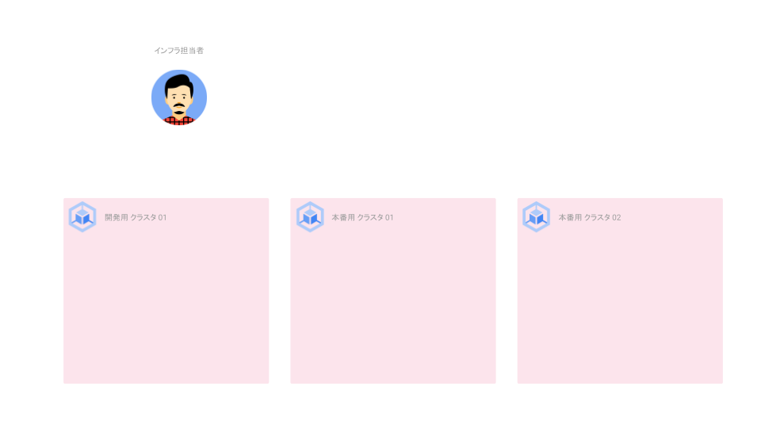

### 6.1 GKE クラスタ作成

開発環境用の GKE クラスタを 1 つ、本番環境用の GKE クラスタを 2 つ作成します。

```shell
for cluster_name in dev-cluster01 prod-cluster01 prod-cluster02
do
  gcloud container clusters create ${cluster_name} \
    --workload-pool ${PROJECT_ID}.svc.id.goog \
    --release-channel regular \
    --logging=SYSTEM,WORKLOAD \
    --monitoring=SYSTEM \
    --machine-type e2-medium \
    --zone asia-northeast1-b \
    --async
done
```

[Kubernetes Engine](https://console.cloud.google.com/kubernetes/list/overview) から GUI で確認できます。

<aside class="negative">
注: 作成完了まで最大 10 分程度かかることがあります。
</aside>

### 6.2 クラスタ作成完了まで待機

6.1 のコマンドは非同期実行のためのオプションがついているため、コマンドの成功失敗に関わらず、すぐ結果が返ってきます。

3 つのクラスタの作成が完了し、稼働状態 (**RUNNING**) になるまで待ちます。

```shell
watch -n 5 gcloud container clusters list --format "value\(name,status\)"
```

すべてのクラスタが **RUNNING** になったら、`Ctrl-C` でコマンドを終了させます。

### 6.2 クラスタ認証情報の取得

Kubernetes の操作には `kubectl` という CLI を使います。`kubectl` から作成したクラスタを操作するために認証情報を取得します。

```shell
for cluster_name in dev-cluster01 prod-cluster01 prod-cluster02
do
  gcloud container clusters get-credentials ${cluster_name} --zone=asia-northeast1-b
done
```

### 6.3 クラスタ認証名 (コンテキスト) の簡素化

`kubectl` では操作対象のクラスタを認証情報も合わせ、**コンテキスト**というもので管理しています。デフォルトでは長いコンテキスト名が付いてしまうため、以降の手順で簡単に指定できるように短い名称に変えます。

```shell
kubectl config rename-context gke_${PROJECT_ID}_asia-northeast1-b_dev-cluster01 dev01
kubectl config rename-context gke_${PROJECT_ID}_asia-northeast1-b_prod-cluster01 prod01
kubectl config rename-context gke_${PROJECT_ID}_asia-northeast1-b_prod-cluster02 prod02
```

### 6.4 クラスタのフリートへの登録

[フリート](https://cloud.google.com/anthos/multicluster-management/fleets)とはクラスタを論理的に編成するための Google Cloud のコンセプトです。これを使うことでマルチクラスタ機能の使用と管理、複数のシステム間での一貫したポリシーの適用が可能になります。

```shell
for cluster_name in dev-cluster01 prod-cluster01 prod-cluster02
do
  gcloud container hub memberships register ${cluster_name} \
  --gke-cluster=asia-northeast1-b/${cluster_name} \
  --enable-workload-identity
done
```

## Git リポジトリ (Cloud Source Repositories) の用意

クラスタに適用する設定 (マニフェスト) は **GitOps** の形で集中管理します。そこでマニフェストを格納するための Git リポジトリの作成、権限の設定を行います。

<aside class="positive">
Note: ここではハンズオンの環境を Google Cloud のみで実現するために、Cloud Source Repositories を利用しています。GitHub、GitLab など、ご利用中の Git リポジトリを使うことも可能です。
</aside>

本手順のゴールイメージ

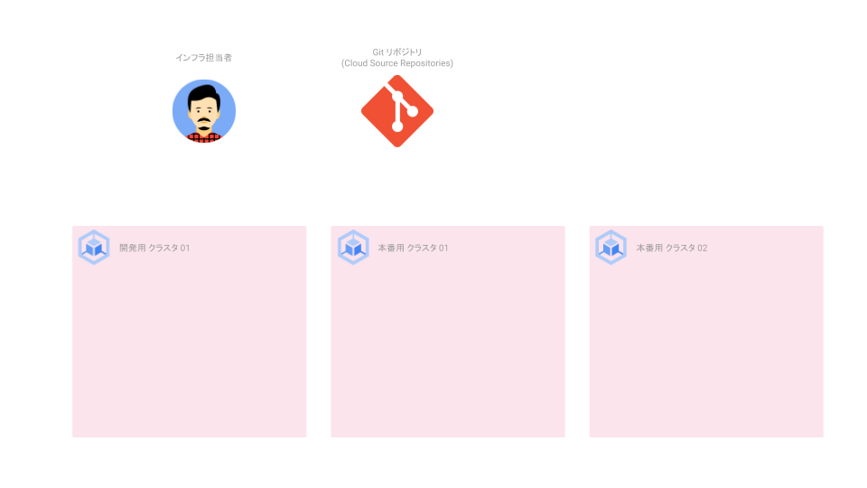

### 7.1 Git リポジトリの作成

マニフェストを格納するための Git リポジトリを [Cloud Source Repositories](https://cloud.google.com/source-repositories) に作成します。

```shell
gcloud source repos create acm-repo
```

### 7.2 Git リポジトリの準備

作成した Git リポジトリは空になっています。後ほどマニフェストを格納するために **main** ブランチに **README ファイル** を作成しておきます。

```shell
cd ${HANDSON_DIR} \
  && gcloud source repos clone acm-repo \
  && cd acm-repo \
  && git checkout -b main \
  && echo "# Repository for ACM" > README.md \
  && git add . \
  && git commit -m 'add readme' \
  && git push origin main \
  && cd ..
```

下記コマンドで出力された URL から GUI にアクセスできます。

```shell
echo https://source.cloud.google.com/${PROJECT_ID}/acm-repo/+/main
```

### 7.2 Config Sync 用サービスアカウントの作成

Config Sync は Cloud Source Repositories からマニフェストを読み取るために権限が必要です。ここでは専用のサービスアカウントを作成します。

```shell
gcloud iam service-accounts create acm-sync \
  --description="Service account for Config Sync" \
  --display-name="acm-sync"
```

### 7.3 作成したサービスアカウントに権限を付与

サービスアカウントは作成しただけでは権限を持っていません。Cloud Source Repositories への読み取り権限を付与します。

```shell
gcloud projects add-iam-policy-binding ${PROJECT_ID} \
  --member="serviceAccount:acm-sync@${PROJECT_ID}.iam.gserviceaccount.com" \
  --role="roles/source.reader"
```

### 7.4 Google Cloud サービスアカウントと Kubernetes サービスアカウントの紐付け

[Workload Identity](https://cloud.google.com/kubernetes-engine/docs/how-to/workload-identity) を使い、先程作成したサービスアカウントを Config Sync が利用する Kubernetes サービスアカウントと紐付けます。これにより、Config Sync が Cloud Source Repositories にあるマニフェストを読み取ることができるようになります。

```shell
gcloud iam service-accounts add-iam-policy-binding \
  --role roles/iam.workloadIdentityUser \
  --member "serviceAccount:${PROJECT_ID}.svc.id.goog[config-management-system/root-reconciler]" \
  acm-sync@${PROJECT_ID}.iam.gserviceaccount.com
```

## Config Sync, Policy Controller のインストール

本手順のゴールイメージ

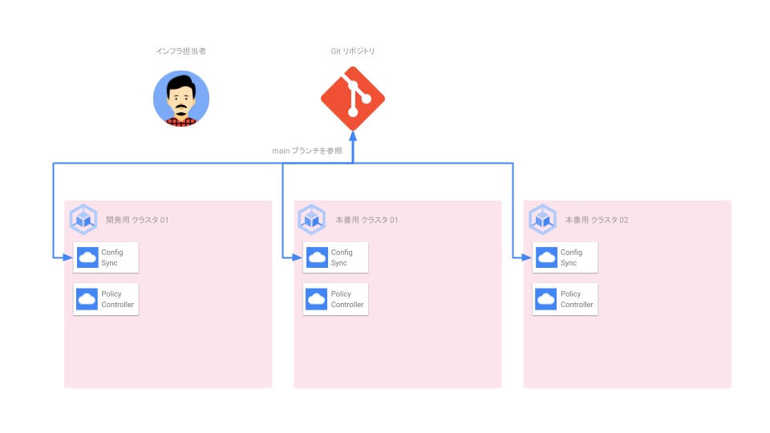

### 8.1 設定ファイルの用意

Config Sync, Policy Controller は設定ファイルを使い、クラスタごとにインストールします。どのような設定ができるかは、[gcloud apply spec フィールド](https://cloud.google.com/anthos-config-management/docs/reference/gcloud-apply-fields) をご確認ください。

```shell
cd ${HANDSON_DIR} \
  && cat << EOF > apply-spec.yaml
applySpecVersion: 1
spec:
  configSync:
    # Config Sync の有効化
    enabled: true
    # Git リポジトリ内のコード形式 (非構造化)
    sourceFormat: unstructured
    # Sync 対象の Git リポジトリ
    syncRepo: https://source.developers.google.com/p/${PROJECT_ID}/r/acm-repo
    # Sync 対象のブランチ名
    syncBranch: main
    # Sync 対象のリビジョン
    syncRev: HEAD
    # Git リポジトリとの認証方法 (Workload Identity から Service Account を利用)
    secretType: gcpserviceaccount
    # Service Account のメールアドレスを指定
    gcpServiceAccountEmail: acm-sync@${PROJECT_ID}.iam.gserviceaccount.com
    # Sync 対象のディレクトリ
    policyDir: /
    # Config Sync により設定されたリソースの上書きを許可するか (デフォルトは False)
    preventDrift: false
  policyController:
    # Policy Controller の有効化
    enabled: true
    # 全ての拒否動作と Dryrun での失敗をログ対象とするか (デフォルトは False)
    logDeniesEnabled: true
EOF
```

### 8.2 Config Sync, Policy Controller のインストール

3 つのクラスタ全てで同じ設定を使い、Config Sync、Policy Controller をインストールします。

```shell
for cluster_name in dev-cluster01 prod-cluster01 prod-cluster02
do
  gcloud beta container hub config-management apply \
    --membership=${cluster_name} \
    --config=./apply-spec.yaml
done
```

### 8.3 インストール確認

Config Sync, Policy Controller がインストールされ、稼働状態になるまで待ちます。

```shell
watch -n 5 gcloud beta container hub config-management status
```

すべてのクラスタの Status が **SYNCED**、Policy_Controller が **INSTALLED** になったら、`Ctrl-C` でコマンドを終了させます。 [Kubernetes Engine - 構成管理](https://console.cloud.google.com/kubernetes/config_management) から GUI でも確認できます。

## Config Sync を利用した GKE クラスタの設定

本手順のゴールイメージ

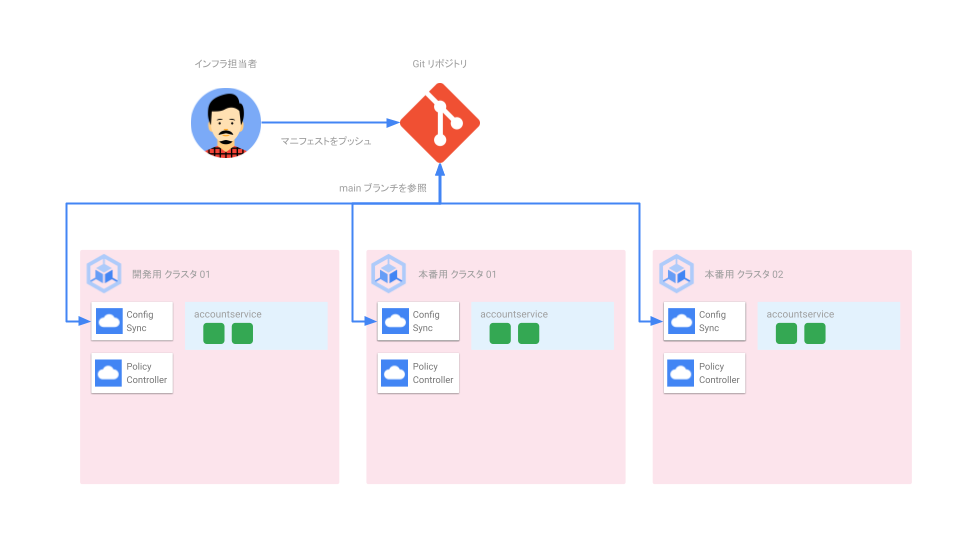

### 9.1 Sync 対象のディレクトリに移動

```shell
cd ${HANDSON_DIR}/acm-repo
```

### 9.2 Namespace と権限の作成

accountservice という名前空間、またその名前空間内の Pod を閲覧する権限、それを Google グループに付与する設定を作成します。

```shell
cat << EOF > namespace.yaml
---
apiVersion: v1
kind: Namespace
metadata:
  name: accountservice
EOF
cat << EOF > accountservice.yaml
---
apiVersion: rbac.authorization.k8s.io/v1
kind: Role
metadata:
  namespace: accountservice
  name: pod-reader
rules:
- apiGroups: [""]
  resources: ["pods"]
  verbs: ["get", "watch", "list"]
---
kind: RoleBinding
apiVersion: rbac.authorization.k8s.io/v1
metadata:
  name: pod-reader-binding
  namespace: accountservice
subjects:
# Google Group
- kind: Group
  name: accountservice-ro-group@example.com
roleRef:
  kind: Role
  name: pod-reader
  apiGroup: rbac.authorization.k8s.io
EOF
```

### 9.3 Git へのプッシュ

作成した設定ファイルを Git リポジトリにプッシュします。

```shell
git add . && git commit -m 'add accountservice.yaml' && git push origin main
```

### 9.4 クラスタへのデプロイの確認 (kubectl)

開発用クラスタの名前空間一覧を確認します。**accountservice** が作成されるまで待ちます。

```shell
kubectl get namespace --context dev01 --watch
```

名前空間 accountservice が作られたら `Ctrl-C` でコマンドを終了させます。

`--context` の引数を本番クラスタ (prod01, prod02) の指定に変え、実行してみてください。開発クラスタと同じように名前空間が作られているはずです。

### 9.5 クラスタへのデプロイの確認 (nomos)

ACM では複数のクラスタを管理する CLI として `nomos` が用意されています。これを使うことで、複数のクラスタの状況、Config Sync により管理されているリソースを一覧化して見ることができます。

以下のコマンドは、3 クラスタすべての情報を 1 秒おきに表示します。

```shell
nomos status --contexts dev01,prod01,prod02 --poll 1s
```

確認後 `Ctrl-C` でコマンドを終了させます。

### 9.6 手動で作成したリソースを削除し、自動で復旧することを確認 (差分の解消)

```shell
kubectl delete -f accountservice.yaml --context dev01 \
  && nomos status --contexts dev01,prod01,prod02 --poll 1s
```

Git で定義されているあるべき状態と、現在の差分が検出され、自動的に修正 (削除したものが再作成) されます。確認後 `Ctrl-C` でコマンドを終了させます。

### 9.7 Git リポジトリからリソースを削除、クラスタに反映されることを確認

Git から名前空間を除くリソースを削除します。すべてのクラスタからリソースが削除されることを確認します。

```shell
git rm accountservice.yaml && git commit -m 'delete accountservice.yaml' && git push origin main \
  && nomos status --contexts dev01,prod01,prod02 --poll 1s
```

確認後 `Ctrl-C` でコマンドを終了させます。

Config Sync ではリソースの誤削除を防ぐため、一度のコミットですべての名前空間、リソースを削除することができないようになっています。そのため、本手順でリソースを、次の手順で名前空間を削除するようにしています。[KNV2006: Config Management Erros](https://cloud.google.com/anthos-config-management/docs/reference/errors#knv2006)

### 9.8 Git リポジトリから名前空間リソースを削除、クラスタに反映されることを確認

Git から名前空間リソースを削除します。すべてのクラスタから名前空間が削除されることを確認します。

```shell
git rm namespace.yaml && git commit -m 'delete namespace.yaml' && git push origin main \
  && nomos status --contexts dev01,prod01,prod02 --poll 1s
```

確認後 `Ctrl-C` でコマンドを終了させます。

## 本番、開発クラスタで Sync するブランチを分ける

ここまで 3 クラスタすべてが同じ Git リポジトリ、ブランチを参照しており、同じ設定が適用されていました。現実では本番、開発では異なる設定となることがほとんどです。

今回のハンズオンでは Git リポジトリは同じものを参照し、ブランチで本番、開発を区別することとします。

本手順のゴールイメージ


### 10.1 本番、開発用の設定ファイルを作成

参照するブランチを **prod**, **dev** に修正したファイルを作成します。

```shell
cd ${HANDSON_DIR}
cat apply-spec.yaml | sed -e 's/syncBranch: main/syncBranch: prod/' -e 's/preventDrift: false/preventDrift: true/' -e '5s/enabled: true/enabled: false/' > apply-spec-prod.yaml
cat apply-spec.yaml | sed -e 's/syncBranch: main/syncBranch: dev/' > apply-spec-dev.yaml
```

### 10.2 本番用、開発用の Git ブランチを作成

Git リポジトリにはまだ参照するブランチが作成されていません。**prod**, **dev** のブランチを作成します。

```shell
cd acm-repo \
  && git checkout -b prod \
  && git push origin prod \
  && git checkout -b dev \
  && git push origin dev \
  && cd ..
```

### 10.3 Config Sync の設定変更

先程作成した、本番用、開発用で参照するブランチを分けた設定ファイルを適用します。

本番用クラスタ (Config Sync を一度停止する)

```shell
for num in 01 02
do
  gcloud beta container hub config-management apply \
    --membership=prod-cluster${num} \
    --config=./apply-spec-prod.yaml
done
```

開発用クラスタ

```shell
gcloud beta container hub config-management apply \
  --membership=dev-cluster01 \
  --config=./apply-spec-dev.yaml
```

**注**: 本番環境では [構成ファイルのドリフト防止](https://cloud.google.com/anthos-config-management/docs/how-to/prevent-config-drift) 機能を有効化しようとしています。有効化には一度 Config Sync を止め、再度起動させる必要があります。

### 10.4 本番環境の Config Sync を再度有効化する

```shell
sed -i -e 's/enabled: false/enabled: true' apply-spec-prod.yaml
```

```shell
for num in 01 02
do
  gcloud beta container hub config-management apply \
    --membership=prod-cluster${num} \
    --config=./apply-spec-prod.yaml
done
```

### 10. 設定が反映されたことを確認

参照ブランチが変わったことを `nomos` コマンドで確認します。

```shell
nomos status --contexts dev01,prod01,prod02 --poll 1s
```

確認後 `Ctrl-C` でコマンドを終了させます。

<aside class="positive">
Note: 本番環境で利用する場合、Git リポジトリでのセキュリティ設定も重要となります。例えば今回のようにブランチを分けた場合、本番用ブランチでは操作できるメンバーを絞る、直接プッシュを防ぐ、レビューの Approval 無しにマージさせないなどの保護設定が必要です。
</aside>

## 安全なロールアウト

本番用に 2 クラスタありますが、同じブランチを参照しており、Git リポジトリが更新されるとすぐに設定が反映されます (デフォルトで HEAD が指定されているため)。ここではより安全に参照する **リビジョン** を指定することで Git リポジトリの更新とは分けて、クラスタ設定を管理します。

本手順のゴールイメージ

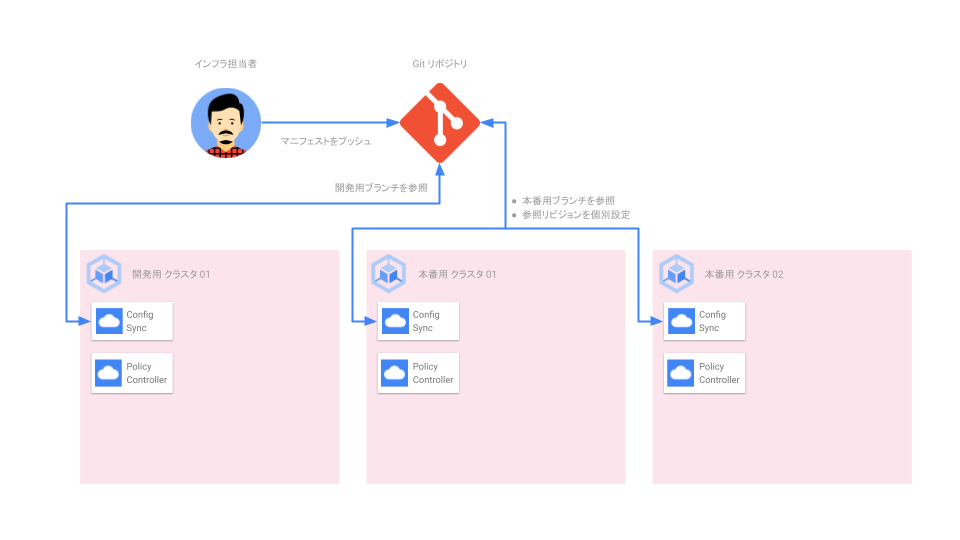

### 11.1 Sync 対象のディレクトリに移動し、本番用クラスタのブランチ (prod) に切り替え

```shell
cd ${HANDSON_DIR}/acm-repo && git checkout prod
```

### 11.2 今適用されているリビジョン (ハッシュ値) を取得

今 Sync されているリビジョン (HEAD) のハッシュ値を取得します。

```shell
REVISION=$(git rev-parse HEAD)
```

### 11.3 リビジョンを固定した設定ファイルを作成

リビジョンを固定した設定ファイルを作成します。

```shell
cd ${HANDSON_DIR} && cat apply-spec-prod.yaml \
  | sed -e "s/syncRev: HEAD/syncRev: ${REVISION}/" \
  > apply-spec-prod-rev.yaml
```

### 11.4 Config Sync の設定変更

Config Sync の設定を更新し、本番クラスタの参照リビジョンを固定します。

```shell
for num in 01 02
do
  gcloud beta container hub config-management apply \
    --membership=prod-cluster${num} \
    --config=./apply-spec-prod-rev.yaml
done
```

### 11.5 設定が反映されたことを確認

参照リビジョンが変わったことを `nomos` コマンドで確認します。

```shell
nomos status --contexts prod01,prod02 --poll 1s
```

確認後 `Ctrl-C` でコマンドを終了させます。

これで本番用クラスタ 01, 02 が特定のリビジョンに固定されました。こうすることで Git リポジトリに反映された設定をクラスタ個別に反映させることが可能になりました。

## 本番用クラスタごとの設定

本手順のゴールイメージ

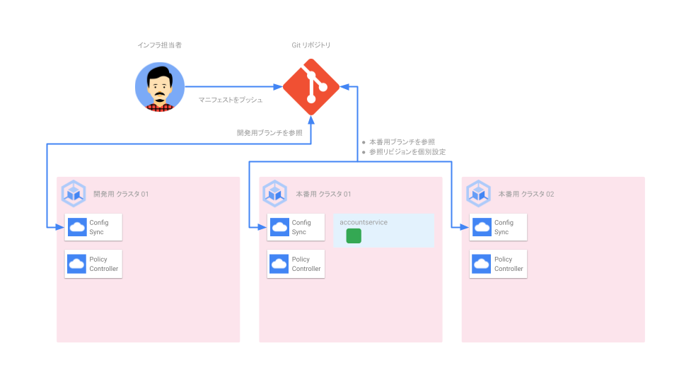

### 12.1 Namespace の作成

productionservice という名前空間を作成します。

```shell
cd ${HANDSON_DIR}/acm-repo \
  && cat << EOF > accountservice.yaml
---
apiVersion: v1
kind: Namespace
metadata:
  name: accountservice
EOF
```

### 12.2 Git へのプッシュ

作成した設定ファイルを Git リポジトリにプッシュします。

```shell
git add . && git commit -m 'add accountservice.yaml' \
  && git push origin prod
```

### 12.3 最新リビジョン (ハッシュ値) を取得

最新のリビジョン (HEAD) のハッシュ値を取得します。

```shell
REVISION=$(git rev-parse HEAD)
```

### 12.4 設定ファイルのリビジョンを更新

設定ファイルに記載されている参照リビジョンを更新します。

```shell
cd ${HANDSON_DIR} && \
  sed -i -e "s/syncRev: .*$/syncRev: ${REVISION}/" apply-spec-prod-rev.yaml
```

### 12.5 Config Sync の設定変更 (本番用クラスタ 01)

Config Sync の設定を更新し、本番クラスタ 01 のみ参照リビジョンを固定します。

```shell
gcloud beta container hub config-management apply \
  --membership=prod-cluster01 \
  --config=./apply-spec-prod-rev.yaml \
  && nomos status --contexts prod01,prod02 --poll 1s
```

本番用クラスタ 01, 02 で異なるリビジョンが適用されることを確認します。確認後 `Ctrl-C` でコマンドを終了させます。

### 12.6 手動でのリソース削除

Config Sync で作成されたリソースを手動で削除します。

```shell
kubectl delete namespace accountservice --context prod01
```

Config Sync で管理されているリソースを修正しようとしたので、拒否されるはずです。 これは Config Sync の Admission Webhook により実現されています。

開発用のクラスタでは preventDrift のパラメータが false に設定していたため、手動での操作自体は拒否されず、操作後自動的に修正されていました。

## その他の環境管理の方法

今回は開発、本番の 2 環境、そしてそれぞれの環境は設定が同一という前提で以下の要素を使い、クラスタ設定を制御しました。

- Git ブランチ
- Git リビジョン

Git, Config Sync では上記に加え下記のような要素を使い、クラスタに適用する設定を制御することができます。

- Git リポジトリ
- Sync 対象のディレクトリ
- [クラスタセレクタ](https://cloud.google.com/anthos-config-management/docs/how-to/clusterselectors)
  - マニフェストを適用するクラスタをマニフェストの中で指定
- [名前空間セレクタ](https://cloud.google.com/anthos-config-management/docs/how-to/namespace-scoped-objects)
  - マニフェストを適用する名前空間をマニフェストの中で指定

また今回は 1 クラスタが参照する Git リポジトリが 1 つでしたが、複数のリポジトリ (正しくは、クラスタ全体設定用に 1 つ、各名前空間ごとに 1 つずつ) を参照するように構成することも可能です。詳しくは [名前空間リポジトリからの同期を構成する](https://cloud.google.com/anthos-config-management/docs/how-to/namespace-repositories) をご確認ください。

それぞれの要素の使い分けなどは [Anthos Config Management を使用した安全なロールアウト](https://cloud.google.com/architecture/safe-rollouts-with-anthos-config-management) をご確認ください。

## Policy Controller を使い GKE クラスタに「ガードレール」を設定する

### Policy Controller とは？

[Policy Controller](https://cloud.google.com/anthos-config-management/docs/concepts/policy-controller) は、Kubernetes の API に対する操作に対しポリシーを設定することができます。

Config Sync により GitOps でリソースの一元管理を実現できましたが、リソースをどのように作るべきか、何を作らせるべきかなどの制限は入っていませんでした。そのような各種制限を設定、そして強制する機能が Policy Controller で「セキュリティガードレール」として機能します。

この機能を利用することで以下のようなことが可能になります。

- リソースの利用者を識別するために、team ラベルの付与を必須とする
- 開発者が default 名前空間を利用するのを禁止する
- Kubernetes のセキュリティベンチマーク [CIS Kubernetes Benchmark](https://cloud.google.com/kubernetes-engine/docs/concepts/cis-benchmarks#cis_kubernetes_benchmark) を適用する

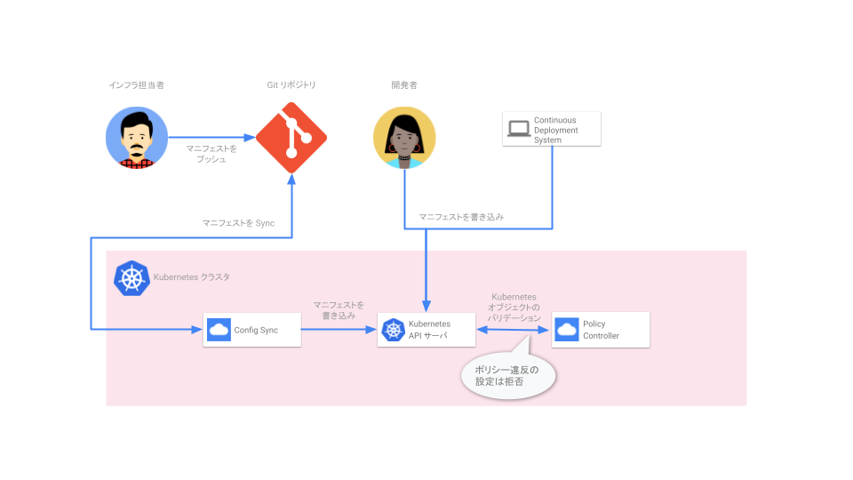

## Policy を活用する

手順 8 で Policy Controller は各クラスタにインストール済みです。その中で自動的に有用なポリシーテンプレートも導入されます。インストールされるテンプレート一覧は [制約テンプレートライブラリ](https://cloud.google.com/anthos-config-management/docs/reference/constraint-template-library#gcpstoragelocationconstraintv1) をご確認ください。

ここではそれらのテンプレートを活用して、3 つセキュリティガードレールを追加します。

- 開発用クラスタ
  - レプリカ数の上限を設定
- 本番用クラスタ
  - default ネームスペースへのアプリケーション作成
  - readness Probe, liveness Probe の設定を強制

## レプリカ数の上限を設定 (開発用クラスタ)

テンプレートライブラリで提供されている [K8sReplicaLimits](https://cloud.google.com/anthos-config-management/docs/reference/constraint-template-library#k8sreplicalimits) を利用して、開発用クラスタでのレプリカ数上限を 3 に設定します。

### 16.1 Sync 対象のディレクトリに移動し、開発用クラスタのブランチ (dev) に切り替え

```shell
cd ${HANDSON_DIR}/acm-repo && git checkout dev
```

### 16.2 ポリシーを作成

```shell
cat << EOF > replica_limit.yaml
apiVersion: constraints.gatekeeper.sh/v1beta1
kind: K8sReplicaLimits
metadata:
  name: replica-limits
spec:
  enforcementAction: dryrun
  match:
    kinds:
    - apiGroups:
      - apps
      kinds:
      - Deployment
  parameters:
    ranges:
    - max_replicas: 3
EOF
```

### 16.3 Git へのプッシュ

作成したポリシーを Git リポジトリにプッシュし、反映を確認します。

```shell
git add . && git commit -m 'add replica limit policy for development' && git push origin dev \
  && nomos status --contexts dev01 --poll 1s
```

反映を確認後 `Ctrl-C` でコマンドを終了させます。

### 16.4 レプリカ数を 4 にした Deployment を作成

```shell
kubectl create deployment nginx-4 --image nginx --replicas 4 --context dev01
```

### 16.5 監査結果の表示

手順 15.3 で作成したポリシーは dryrun モード (enforcementAction 項目) で設定していました。そのためポリシー違反の設定は拒否ではなく、監視されます。ポリシー違反が検出されているかを確認します。

```shell
kubectl get K8sReplicaLimits replica-limits -o yaml --context dev01
```

出力結果の最下部に **violations** としてポリシー違反の Deployment が表示されていることを確認します。

## default ネームスペースの利用を制限 (本番用クラスタ)

[K8sRectrictNamespaces](https://cloud.google.com/anthos-config-management/docs/reference/constraint-template-library#k8srestrictnamespaces) ポリシーを使うことで、名前空間の利用を制限できます。

ここではサービスで通常利用しないほうが良い default の名前空間の利用を制限します。

### 17.1 Sync 対象のディレクトリに移動し、本番用クラスタのブランチ (prod) に切り替え

```shell
cd ${HANDSON_DIR}/acm-repo && git checkout prod
```

### 17.2 ポリシーを作成

```shell
cat << EOF > restrict-default-namespace.yaml
apiVersion: constraints.gatekeeper.sh/v1beta1
kind: K8sRestrictNamespaces
metadata:
  name: restrict-default-namespace
spec:
  match:
    kinds:
      - apiGroups: ["apps"]
        kinds: ["Deployment","Pod","ReplicaSet"]
  enforcementAction: deny
  parameters:
    restrictedNamespaces:
    - default
EOF
```

### 17.3 Git へのプッシュ

作成したポリシーを Git リポジトリにプッシュします。

```shell
git add . && git commit -m 'restrict default namespace for production' \
  && git push origin prod
```

<aside class="positive">
Note: 本番クラスタは参照リビジョンを固定しているため、ポリシーを適用するには Config Sync の設定を更新する必要があります。
</aside>

### 17.4 今適用されているリビジョン (ハッシュ値) を取得

更新が含まれているリビジョン (HEAD) のハッシュ値を取得します。

```shell
REVISION=$(git rev-parse HEAD)
```

### 17.5 リビジョンを固定した設定ファイルを作成

リビジョンを固定した設定ファイルを作成します。

```shell
cd ${HANDSON_DIR} && cat apply-spec-prod-rev.yaml \
  | sed -e "s/syncRev: .*$/syncRev: ${REVISION}/" \
  > apply-spec-prod-rev-17.yaml
```

### 17.6 本番クラスタ 01 にポリシーを反映

Config Sync の設定を更新し、本番クラスタ 01 にポリシーを反映します。

```shell
gcloud beta container hub config-management apply \
  --membership=prod-cluster01 \
  --config=./apply-spec-prod-rev-17.yaml \
  && nomos status --contexts prod01 --poll 1s
```

restrict-default-namespace リソースが Sync されたら、`Ctrl-C` でコマンドを終了させます。

### 17.7 Deployment を default ネームスペースに作成

```shell
kubectl create deployment nginx --image nginx --replicas 4 --context prod01
```

<aside class="negative">
手順 17.2 で作成したポリシーは deny モード (enforcementAction 項目) で設定しました。そのためポリシー違反の設定は作成が拒否されます。
</aside>

## readiness Probe, liveness Probe の設定を強制 (本番用クラスタ)

[K8sRequiredProbes](https://cloud.google.com/anthos-config-management/docs/reference/constraint-template-library#k8srequiredprobes) ポリシーを使うことで、Pod に readiness Probe または liveness Probe の利用を強制できます。本番用サービスでは、アプリケーションに合わせた Probe を適切に設定することが良いプラクティスです。

ここでは両方の Probe が設定されていない Pod の作成を制限します。

### 18.1 ポリシーを作成

```shell
cd ${HANDSON_DIR}/acm-repo \
  && cat << EOF > must-have-probes.yaml
apiVersion: constraints.gatekeeper.sh/v1beta1
kind: K8sRequiredProbes
metadata:
  name: must-have-probes
spec:
  enforcementAction: deny
  match:
    kinds:
    - apiGroups:
      - ""
      kinds:
      - Pod
  parameters:
    probeTypes:
    - tcpSocket
    - httpGet
    - exec
    probes:
    - readinessProbe
    - livenessProbe
EOF
```

### 18.2 Git へのプッシュ

作成したポリシーを Git リポジトリにプッシュします。

```shell
git add . && git commit -m 'restrict workloads without probes for production' \
  && git push origin prod
```

<aside class="positive">
Note: 本番クラスタは参照リビジョンを固定しているため、ポリシーを適用するには Config Sync の設定を更新する必要があります。
</aside>

### 18.3 今適用されているリビジョン (ハッシュ値) を取得

更新が含まれているリビジョン (HEAD) のハッシュ値を取得します。

```shell
REVISION=$(git rev-parse HEAD)
```

### 18.4 リビジョンを固定した設定ファイルを作成

リビジョンを固定した設定ファイルを作成します。

```shell
cd ${HANDSON_DIR} && cat apply-spec-prod-rev-16.yaml \
  | sed -e "s/syncRev: .*$/syncRev: ${REVISION}/" \
  > apply-spec-prod-rev-18.yaml
```

### 18.5 本番クラスタ 01 にポリシーを反映

Config Sync の設定を更新し、本番クラスタ 01 にポリシーを反映します。

```shell
gcloud beta container hub config-management apply \
  --membership=prod-cluster01 \
  --config=./apply-spec-prod-rev-18.yaml \
  && nomos status --contexts prod01 --poll 1s
```

must-have-probes リソースが Sync されたら、`Ctrl-C` でコマンドを終了させます。

### 18.6 Probe 設定がない Pod を service1 ネームスペースに作成

```shell
kubectl create namespace service1 --context prod01 \
  && kubectl run nginx-without-probes --image nginx -n service1 --context prod01
```

<aside class="negative">
前のセクションと同様にポリシーは deny モード (enforcementAction 項目) で設定しました。そのためポリシー違反のリソースは作成が拒否されます。
</aside>

## Config Controller

### Config Controller とは？

[Config Controller](https://cloud.google.com/anthos-config-management/docs/concepts/config-controller-overview) は Google Cloud リソースのプロビジョニングとオーケストレーション (わかりやすく言うと IaC を実現します) を行うホスト型サービスです。本サービスにより、Google Cloud の環境を Kubernetes Resource Model で構築、管理できます。

Config Controller は下記 3 つのコンポーネントで構築されています。

- Config Sync
- Policy Controller
- Config Connector

Config Connector が KRM を Google Cloud のリソースに変換し作成する機能を担っています。Config Sync, Policy Controller により、Google Cloud のリソース管理機能に、GitOps、セキュリティガードレールが追加されています。


## Config Controller の設定

### 20.1 Config Controller を作成

```shell
gcloud anthos config controller create config-controller01 \
  --location=us-central1 --async
```

<aside class="negative">
注: 2022 年 3 月現在 Config Controller は us-central1 (アイオワ), us-east1 (サウスカロライナ) リージョンでのみの展開となっています。また作成完了まで 15 分以上かかることがあります。
</aside>

### 20.2 Config Controller の作成完了を確認

```shell
watch -n 5 gcloud anthos config controller list --location us-central1
```

作成が完了 (STATE が **RUNNING**) したら、`Ctrl-C` でコマンドを終了させます。

### 20.3 Config Controller クラスタ認証情報の取得

Config Controller は GKE クラスタにホストされた形で提供されます。作成したクラスタを CLI (kubectl) から操作するために認証情報を取得します。

```shell
gcloud anthos config controller get-credentials config-controller01 \
  --location us-central1
```

### 20.4 Config Controller に権限を付与

Config Controller は Google Cloud のリソースを作成、管理します。そのため、それらを実行するための権限を付与する必要があります。

```shell
export SA_EMAIL="$(kubectl get ConfigConnectorContext -n config-control \
    -o jsonpath='{.items[0].spec.googleServiceAccount}' 2> /dev/null)"
gcloud projects add-iam-policy-binding "${PROJECT_ID}" \
    --member "serviceAccount:${SA_EMAIL}" \
    --role "roles/owner"
```

<aside class="negative">
注: ここではプロジェクトの Owner 権限を付与しています。Config Controller から操作したいリソースが事前に分かっている場合はより絞った権限を付与することも可能です。
</aside>

## Config Controller の GitOps 設定

Config Controller には Config Sync が含まれており、簡単に GitOps でリソースを管理することができます。

<aside class="positive">
Note: 手順 7 では Cloud Source Repositories などの設定を `gcloud` コマンドから行っていました。本手順では Google Cloud リソースの設定を Conig Controller の機能 (KRM でリソースを作成、管理する) を使って行っています。
</aside>

### 21.1 Config Controller 用 Git リポジトリ用マニフェスト作成

```shell
cd ${HANDSON_DIR} \
  && cat << EOF > cc-repo.yaml
apiVersion: sourcerepo.cnrm.cloud.google.com/v1beta1
kind: SourceRepoRepository
metadata:
  name: config-controller-repo
  namespace: config-control
EOF
```

### 21.2 Config Controller 用 Git リポジトリ作成

```shell
kubectl apply -f cc-repo.yaml
```

### 21.3 Git リポジトリの準備

作成した Git リポジトリは空になっています。後ほどマニフェストを格納するために **main** ブランチに **README ファイル** を作成しておきます。

```shell
gcloud source repos clone config-controller-repo \
  && cd config-controller-repo \
  && git checkout -b main \
  && echo "# Repository for Config Controller" > README.md \
  && git add . \
  && git commit -m 'add readme' \
  && git push origin main
```

### 21.4 GitOps 用の IAM 設定ファイルを作成

```shell
cd ${HANDSON_DIR} \
  && cat << EOF > gitops-iam.yaml
apiVersion: iam.cnrm.cloud.google.com/v1beta1
kind: IAMServiceAccount
metadata:
  name: config-sync-sa
  namespace: config-control
spec:
  displayName: ConfigSync
---
apiVersion: iam.cnrm.cloud.google.com/v1beta1
kind: IAMPolicyMember
metadata:
  name: config-sync-wi
  namespace: config-control
spec:
  member: serviceAccount:${PROJECT_ID}.svc.id.goog[config-management-system/root-reconciler]
  role: roles/iam.workloadIdentityUser
  resourceRef:
    apiVersion: iam.cnrm.cloud.google.com/v1beta1
    kind: IAMServiceAccount
    name: config-sync-sa
---
apiVersion: iam.cnrm.cloud.google.com/v1beta1
kind: IAMPolicyMember
metadata:
  name: allow-configsync-sa-read-csr
  namespace: config-control
spec:
  member: serviceAccount:config-sync-sa@${PROJECT_ID}.iam.gserviceaccount.com
  role: roles/source.reader
  resourceRef:
    apiVersion: resourcemanager.cnrm.cloud.google.com/v1beta1
    kind: Project
    external: projects/${PROJECT_ID}
EOF
```

### 21.5 GitOps 用 IAM 設定の適用

```shell
kubectl apply -f gitops-iam.yaml
```

### 21.6 Config Sync, Policy Controller 設定ファイルの用意

```shell
cat << EOF > apply-spec-config-controller.yaml
apiVersion: configmanagement.gke.io/v1
kind: ConfigManagement
metadata:
  name: config-management
spec:
  enableMultiRepo: true
  enableLegacyFields: true
  policyController:
    enabled: true
  clusterName: krmapihost-config-controller01
  git:
    policyDir: /
    secretType: gcpserviceaccount
    gcpServiceAccountEmail: config-sync-sa@${PROJECT_ID}.iam.gserviceaccount.com
    syncBranch: main
    syncRepo: https://source.developers.google.com/p/${PROJECT_ID}/r/config-controller-repo
  sourceFormat: unstructured
EOF
```

### 21.7 Config Sync, Policy Controller のインストール

```shell
kubectl apply -f apply-spec-config-controller.yaml
```

### 21.8 インストール確認

Config Sync, Policy Controller がインストールされ、稼働状態になるまで待ちます。

```shell
nomos status --contexts $(kubectl config current-context) --poll 5s
```

クラスタの状態が **SYNCED** になったら`Ctrl-C` でコマンドを終了させます。

## Config Controller を使った Google Cloud リソースの作成

### 22.1 Cloud Storage 用設定ファイルの作成 (Tokyo リージョン)

```shell
cd ${HANDSON_DIR}/config-controller-repo \
  && cat << EOF > storage-bucket-tokyo.yaml
apiVersion: storage.cnrm.cloud.google.com/v1beta1
kind: StorageBucket
metadata:
  annotations:
    cnrm.cloud.google.com/force-destroy: "false"
  name: ${PROJECT_ID}-bucket-tokyo
  namespace: config-control
spec:
  storageClass: STANDARD
  location:	asia-northeast1
  versioning:
    enabled: true
  uniformBucketLevelAccess: true
EOF
```

### 22.2 Git へのプッシュ

作成したリソース用マニフェストを Git リポジトリにプッシュします。

```shell
git add . && git commit -m 'create a storage bucket in Tokyo' \
  && git push origin main \
  && nomos status --contexts $(kubectl config current-context) --poll 1s
```

Cloud Storage が作られたら `Ctrl-C` でコマンドを終了させます。

[Cloud Storage 管理画面](https://console.cloud.google.com/storage/browser) から GUI で確認できます。

### 22.3 Cloud Storage の作成ロケーションを Tokyo リージョンに制限するポリシー作成

```shell
cat << EOF > gcs-tokyo-only.yaml
apiVersion: constraints.gatekeeper.sh/v1beta1
kind: GCPStorageLocationConstraintV1
metadata:
  name: tokyo-only
spec:
  enforcementAction: deny
  match:
    kinds:
    - apiGroups:
      - storage.cnrm.cloud.google.com
      kinds:
      - StorageBucket
  parameters:
    locations:
    - asia-northeast1
EOF
```

### 22.4 Git へのプッシュ

作成したポリシーを Git リポジトリにプッシュします。

```shell
git add . && git commit -m 'restrict bucket creation only in Tokyo' \
  && git push origin main \
  && nomos status --contexts $(kubectl config current-context) --poll 1s
```

tokyo-only というポリシーが作られたら `Ctrl-C` でコマンドを終了させます。

### 22.5 Cloud Storage 用設定ファイルの作成 (Osaka リージョン)

```shell
cat << EOF > storage-bucket-tokyo.yaml
apiVersion: storage.cnrm.cloud.google.com/v1beta1
kind: StorageBucket
metadata:
  annotations:
    cnrm.cloud.google.com/force-destroy: "false"
  name: ${PROJECT_ID}-bucket-osaka
  namespace: config-control
spec:
  storageClass: STANDARD
  location:	asia-northeast2
  versioning:
    enabled: true
  uniformBucketLevelAccess: true
EOF
```

### 22.6 Git へのプッシュ

作成したリソース用マニフェストを Git リポジトリにプッシュします。

```shell
git add . && git commit -m 'create a storage bucket in Osaka' \
  && git push origin main \
  && nomos status --contexts $(kubectl config current-context) --poll 1s
```

Tokyo リージョンのみ作成可能なポリシーが設定済みなため、作成に失敗しエラーが出力されます。エラーが確認できたら `Ctrl-C` でコマンドを終了させます。

## まとめ

### 23.1 大規模な Kubernetes 環境を一貫性を持った形でセキュアに管理する


### 23.2 Google Cloud のリソースを KRM で管理する (IaC の実現)


## クリーンアップ

環境のクリーンアップを行います。

### プロジェクトの削除

最も簡単な方法は Google Cloud プロジェクトごと削除する方法です。

```shell
gcloud projects delete ${PROJECT_ID} --quiet
```
